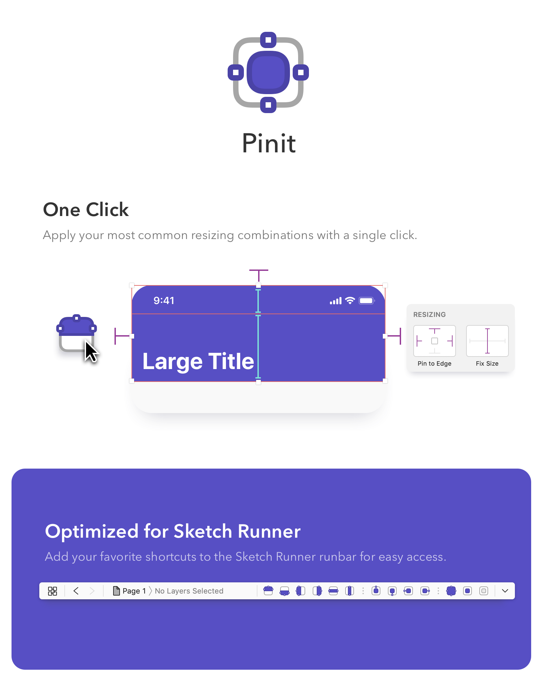

## Installation

- Install with Sketch Runner
  OR
- [Download](https://github.com/acollurafici/PinUp/releases/tag/v0.3.2) the latest release of the plugin
- Un-zip
- Double-click on PinUp.sketchplugin

## Setup
- Add actions to Sketch Runner's Runbar

## Shortcuts

###   Fixed Header 
- Pin Top,Left,Right
- Fixed Height

###   Fixed Footer
- Pin Bottom,Left,Right 
- Fixed Height

###   Fixed Left Side Bar 
- Pin Top,Left,Bottom 
- Fixed Width

###   Fixed Right Side Bar 
- Pin Top, Right, Bottom 
- Fixed Width

###   Row Fixed Height 
- Pin Left, Right 
- Fixed Height

###   Column Fixed Width 
- Pin Top, Bottom 
- Fixed Width

###   Pin Top 
- Pin Top 
- Fixed Height, Width

###   Pin Bottom 
- Pin Bottom 
- Fixed Height, Width

###   Pin Left 
- Pin Left 
- Fixed Height, Width

###   Pin Right 
- Pin Right 
- Fixed Height, Width

###   Pin All 
- Pin Top, Left, Bottom, Right 

###   Fixed Size
- Fixed Height, Width

###   Clear All
- Clear All